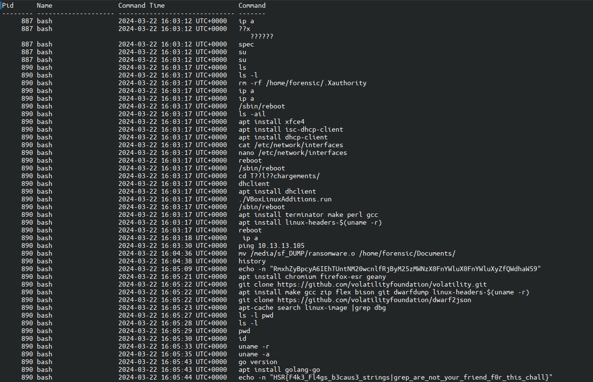
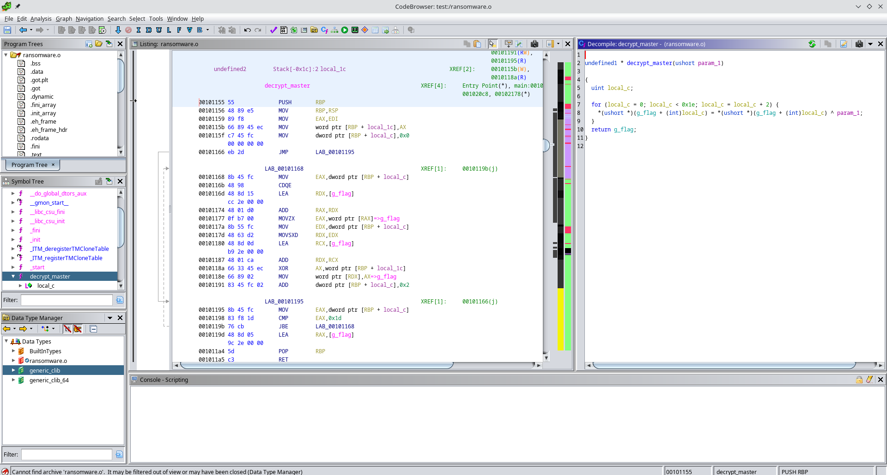
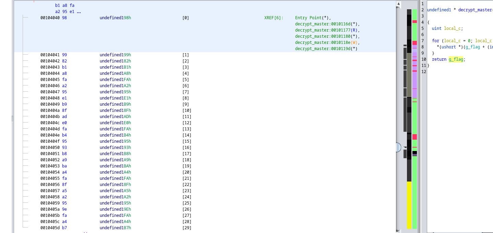

# Forensic - Perte de mémoire

Voici le lien contenant le dump et les profils à créer pour ce challenge.

- https://mega.nz/folder/MSNx2ATC#2t5MQ8pMD_Z7TN3-Ok4Fiw

Nous avons, une fois téléchargé, un dump de la RAM d'une machine inconnue, ainsi qu'un PCAP.

```bash
unxz dump.xz
tar -xvf dump
```

## Partie 1/6

L'outil phare pour l'analyse de RAM est le Framework volatility, que l'on installe:

```bash
cd ~
git clone https://github.com/volatilityfoundation/volatility
git clone https://github.com/volatilityfoundation/volatility3
```

- https://book.hacktricks.xyz/generic-methodologies-and-resources/basic-forensic-methodology/memory-dump-analysis/volatility-cheatsheet

### Connaître le kernel

On identifie tout d'abord l'OS sur lequel le dump a été effectué avec le plugin **banners.Banners** de vol3:

```bash
 python3 ~/volatility3/vol.py -f hsr2024.dmp banners.Banners
Volatility 3 Framework 2.5.2
Progress:  100.00               PDB scanning finished
Offset  Banner

0x2256d578      Linux version 4.19.0-26-amd64 (debian-kernel@lists.debian.org) (gcc version 8.3.0 (Debian 8.3.0-6)) #1 SMP Debian 4.19.304-1 (2024-01-09)
0x23200180      Linux version 4.19.0-26-amd64 (debian-kernel@lists.debian.org) (gcc version 8.3.0 (Debian 8.3.0-6)) #1 SMP Debian 4.19.304-1 (2024-01-09)
0x23cc4314      Linux version 4.19.0-26-amd64 (debian-kernel@lists.debian.org) (gcc version 8.3.0 (Debian 8.3.0-6)) #1 SMP Debian 4.19.304-1 (2024-01-09)
```

On peut également faire:

```bash
strings openme.dmp | grep "Linux version" | sort | uniq
```

**Linux** oblige, nous allons devoir construire un profil correspondant à ce kernel pour analyser le dump avec volatility.
Voici le résumé de ce que nous allons faire et qui constitue sans doute la partie la plus difficile:

- https://andreafortuna.org/2019/08/22/how-to-generate-a-volatility-profile-for-a-linux-system/

### Installer les headers, symboles de debug et utilitaires

Pour ne pas se tromper d'image, on recherche la version de Debian à partir du kernel:

- https://packages.debian.org/buster/linux-image-4.19.0-26-amd64

On crée alors une VM Virtualbox avec l'iso de **Debian10**:

- `debian-10.13.0-amd64-netinst.iso`: https://www.debian.org/releases/buster/debian-installer/

**Notes d'installation**:

- prévoir au moins 20G dans une partition
- stockage = controlleur SATA comprenant 1 vdi + 1 iso
- système  = optique, disque dur + activer cache E/S + EFI (os spécial) + HyperV

```bash
sudo apt install linux-headers-4.10.0-26-amd64 linux-image-4.10.0-26-amd64-dbg git build-essential dwarfdump make zip
```

### Construire le profil avec vol2

```bash
git clone https://github.com/volatilityfoundation/volatility
cd volatility/volatility/tools/linux
make
cd
zip $(lsb_release -i -s)_$(uname -r)_profile.zip volatility/tools/linux/module.dwarf /usr/lib/debug/boot/System.map-4.19.0-26-amd64

# Si vol2 est installé dans la VM, sinon copier sur l'hôte
cp Debian_4.19.0-26-amd64_profile.zip volatility/volatility/plugins/overlays/linux
```

Attention, le profil crée se nommera **LinuxDebian_4_19_0-26-amd64_profilex64**, la plupart des plugins seront en **linux_bash, linux_pslist** etc. Pour retrouver le nom du profil:

```bash
python2 ~/volatility/vol.py --info | grep Debian
```

### Construire les symboles vol3 (pour la partie 3)

**Attention: avoir une RAM > 5Go** pour./dwarf2json

```bash
sudo apt install golang
git clone https://github.com/volatilityfoundation/dwarf2json
cd dwarf2json/
go mod download github.com/spf13/pflag
go build
./dwarf2json linux --elf /usr/lib/debug/vmlinux-4.19.0-26-amd64 > ~/vmlinux-4.19.0-26-amd64.json


# Si vol3 installé dans la VM, sinon copier sur l'hôte
cp vmlinux-4.19.0-26-amd64.json volatility3/volatility3/symbols
```

### Analyse avec vol2 (retour sur l'hôte)

Nous pouvons maintenant utiliser les profils Linux.
Commençons par l'historique de la machine.

```bash
python2 ~/volatility/vol.py -f hsr2024.dmp --profile=LinuxDebian_4_19_0-26-amd64_profilex64 linux_bash
```



Celle-ci a été mise à jour, a pingé `10.13.13.105` puis a déposé un ransomware depuis une clé dans `/home/forensic/Documents`.
Passée la mesure anti `strings`, on observe également flag:

```bash
echo -n "RmxhZyBpcyA6IEhTUntNM20wcnlfRjByM25zMWNzX0FnYWluX0FnYWluXyZfQWdhaW59" | base64 -d
Flag is : HSR{M3m0ry_F0r3ns1cs_Again_Again_&_Again}
```

## Partie 2/6

Nous allons reconstruire l'arborescence du dump avec le plugin **linux_recover_filesystem** en root pour ne pas se soucier des permissions.

```bash
mkdir fsystem
sudo python ~/volatility/vol.py -f hsr2024.dmp --profile=LinuxDebian_4_19_0-26-amd64_profilex64  linux_recover_filesystem --dump-dir fsystem
multi internal
multi internal
Recovered 20735 files

sudo chown -R night:wheel fsystem
```

```bash
cd fsystem/home/forensic/Documents/hsr
ls
flag.enc.b64  flag_01.png  hsr_event  ransomware.o
```

On observe une image partiellement en clair ainsi qu'un texte:

```bash
cat hsr_event | tr 'A-Za-z' 'N-ZA-Mn-za-m'

HSR{Easy_fl4g_w1th_GeanY...}
```


## Partie 3/6

Le challenge évoquait des *fichiers chiffrés*, on pense à l'image et à l'historique.
On confirme au passage l'éxécution de GPG avec un autre plugin **linux_pslist**:

```bash
python2 ~/volatility/vol.py -f hsr2024.dmp --profile=LinuxDebian_4_19_0-26-amd64_profilex64  linux_pslist | grep gpg
Volatility Foundation Volatility Framework 2.6.1
0xffff893e36008000 gpg-agent            762             663             1000            1000   0x000000003a210000 2024-03-25 08:53:55 UTC+0000
0xffff893e3761bc00 gpg-agent            1374            1               0               0      0x00000000364be000 2024-03-25 09:34:55 UTC+0000
```

**Attention: plugin vol3 (voir ./dwarf2json plus haut) nécessaire ici:**

Il nous faut alors un outil permettant de récupérer la clé GPG dans le dump afin de déchiffrer `flag.enc`.
Avec une recherche Google:

```bash
git clone 'https://github.com/kudelskisecurity/volatility-gpg'
```

```bash
python3 ~/volatility3/vol.py -f hsr2024.dmp -p ~/volatility-gpg/ linux.gpg_full
Volatility 3 Framework 2.5.2
Progress:  100.00               Stacking attempts finished
Offset  Private key     Secret size     Plaintext
Searching from 31 Mar 2024 09:01:18 UTC to 04 Oct 2024 14:47:27 UTC
Searching from 31 Mar 2024 09:01:44 UTC to 04 Oct 2024 14:47:27 UTC

0x7fc0cc0025a8  3b88f1a573a0a405e2fd60509c01c7d7        64      gs/5}554.Jk0iipqI4_c2jvrF&|x?D
0x7fc0cc0025a8  3b88f1a573a0a405e2fd60509c01c7d7        64      gs/5}554.Jk0iipqI4_c2jvrF&|x?D
```

La clé obtenue permet de recouvrer le flag:

```bash
┌─[night@night-20b7s2ex01]─[~/hsr/forensics/fsystem/home/forensic/Documents/hsr]
└──╼ 4 fichiers, 548Kb)─$ base64 -d flag.enc.b64 > flag.enc
┌─[night@night-20b7s2ex01]─[~/hsr/forensics/fsystem/home/forensic/Documents/hsr]
└──╼ 5 fichiers, 552Kb)─$ gpg -d flag.enc
gpg: AES256.CFB encrypted data
gpg: chiffré avec 1 phrase secrète
Un flag tout simple à trouver et à rentrer pour avoir les points du CTF ;-)

Le flag est : HSR{V0l@tility_w1th_GPG_1s_c00l_Again...in_2024}
```

## Partie 4/6

D'après l'historique `ransomware.o` a ensuite été lancé sur la machine.


Analysons le dans Ghidra, on remarque une fonction `decrypt_master` qui fait un xor entre une section mémoire et un short:

```c
undefined8 main(void)

{
  undefined2 local_12;
  undefined8 local_10;

  puts("[>] 3vil-kevin ransomware 0.0.1-dev");
  puts("[>] Enter 16-bit military grade cryptographic key :");
  __isoc99_scanf(&DAT_00102064,&local_12);
  puts("[+] Decrypting master key...");
  local_10 = decrypt_master(local_12);
  printf("!! TODO ENCRYPT FILE WITH %s\n",local_10);
  return 0;
}
```



En supposant que la section mémoire déchiffrée soit le flag, nous avons cependant un clair connu(HSR{).
En sortant le chiffré et en écrivant un court script python, on obtient le flag:



```python
from itertools import cycle


cipher="989982b1a8faa295e1b98fade0fab49593b8a9baa4fa8fa5a2959efaa4b7"
key="HSR{"

cipher = bytes.fromhex(cipher)
cipher = [b for b in cipher]
key = [ord(c) for c in key]

plain_key = [ t[0]^t[1] for t in zip(cipher,key)]
key = [chr(x) for x in plain_key]

for i in range(len(key),len(cipher)):
        plain_key.append(plain_key[i%len(key)])

plain = [t[0]^t[1] for t in zip(cipher,plain_key)]
plain = [chr(x) for x in plain]
print(''.join(plain))
```

Flag:
`HSR{x0r_1s_g00d_Crypt0_or_N0t}`

## Parties 5/6 (Avec PCAP)

Non terminé, on remarque:

- un échange entre `10.13.13.104` et `10.13.13.109` dans le PCAP
- une connection SSH  à `ssh hsr@10.13.13.104`  et `ssh hsr@10.13.13.105`

```bash
python ~/volatility/vol.py -f hsr2024.dmp --profile=LinuxDebian_4_19_0-26-amd64_profilex64 linux_netstat
...
TCP      10.13.13.109    :49114 10.13.13.104    :   22 ESTABLISHED                   ssh/1335
```

Voici comment terminer les parties 5 et 6 avec **1 autre plugin vol2**, https://or1on-ctf.github.io/2021/07/27/HTB-Business-CTF-Compromise.html

Avec le port 1335  que l'on vient de remarquer, on lance **linux_sshkeys**:


```bash
git clone https://github.com/fox-it/OpenSSH-Session-Key-Recovery
cp ~/OpenSSH-Session-Key-Recovery/volatility2/openssh_sessionkeys.py ~/volatility/contrib/plugins/
python ~/volatility/vol.py -f hsr2024.dmp --profile=LinuxDebian_4_19_0-26-amd64_profilex64 linux_sshkeys -p 1335

Scanning for OpenSSH sshenc structures...

Name                           Pid      PPid     Address            Name                           Key                                                                                                                              IV
------------------------------ -------- -------- ------------------ ------------------------------ -------------------------------------------------------------------------------------------------------------------------------- ----------------------------------------------------------------
ssh [ssh hsr@10.13.13.104]         1335      999 0x00005595fe1d1dc0 aes256-gcm@openssh.com         0cfcce93342a2c43bd05e8f296bb7b4a61a734c3b274eb765017523269443d2b                                                                 64b7a25d5def09e22494242a
ssh [ssh hsr@10.13.13.104]         1335      999 0x00005595fe1d1ea0 aes256-gcm@openssh.com         955f60ba9b171179f584b91e1acd20666859826c5977ec56490553ed29d0ee72
```

On crée le JSON comme indiqué pour le second outil (https://github.com/fox-it/OpenSSH-Network-Parser):

```json
{
        "task_name": "sshd",
        "sshenc_addr": 94102701809088,
        "cipher_name": "aes256-gcm@openssh.com",
        "key": "0cfcce93342a2c43bd05e8f296bb7b4a61a734c3b274eb765017523269443d2b",
        "iv": "64b7a25d5def09e22494242a"
}
{
        "task_name": "sshd",
        "sshenc_addr": 94102701809312,
        "cipher_name": "aes256-gcm@openssh.com",
        "key": "955f60ba9b171179f584b91e1acd20666859826c5977ec56490553ed29d0ee72",
        "iv": "1f4146c82cabf3010ec680de"
}
```

Pour fix l'outil (CTRL+F pynids) https://scribe.rip/@kevintk1/htb-business-ctf-2021-forensic-compromised-1aa265b843a6:

```python
git clone https://github.com/fox-it/OpenSSH-Network-Parser && cd OpenSSH-Network-Parser/openssh_network_parser
```

Comme indiqué, creer un virtualenv python2:

```
pyenv local 2.7
pyenv virtualenv venv
pyenv activate venv
pip install psutil tabulate gevent libnacl cryptography
```

Puis install manuellement pynids:

```bash
git clone https://github.com/MITRECND/pynids && cd pynids
tar -xvf lib*gz && rm -f *gz && cd libnids*
mkdir build && cd build
../configure
make
cp src/libnids.a ../src
```

```bash
cd ../../dist
tar -xvf *gz && rm -f *gz && cd pynids*
python setup.py install
```

De retour pour l'outil principal (network ssh):

```bash
cd ../../../..
python2 setup.py install
```

Enfin , de retour dans le répertoire du dump

```bash
cd ~/hsr/forensics
pyenv local 2.7.18/envs/venv
#CTRL+D, CTRL+ALT+T
mkdir ssh-traffic
network-parser -p hsr2024.pcap --popt keyfile=keys.json --proto ssh -o ssh-traffic/
```
