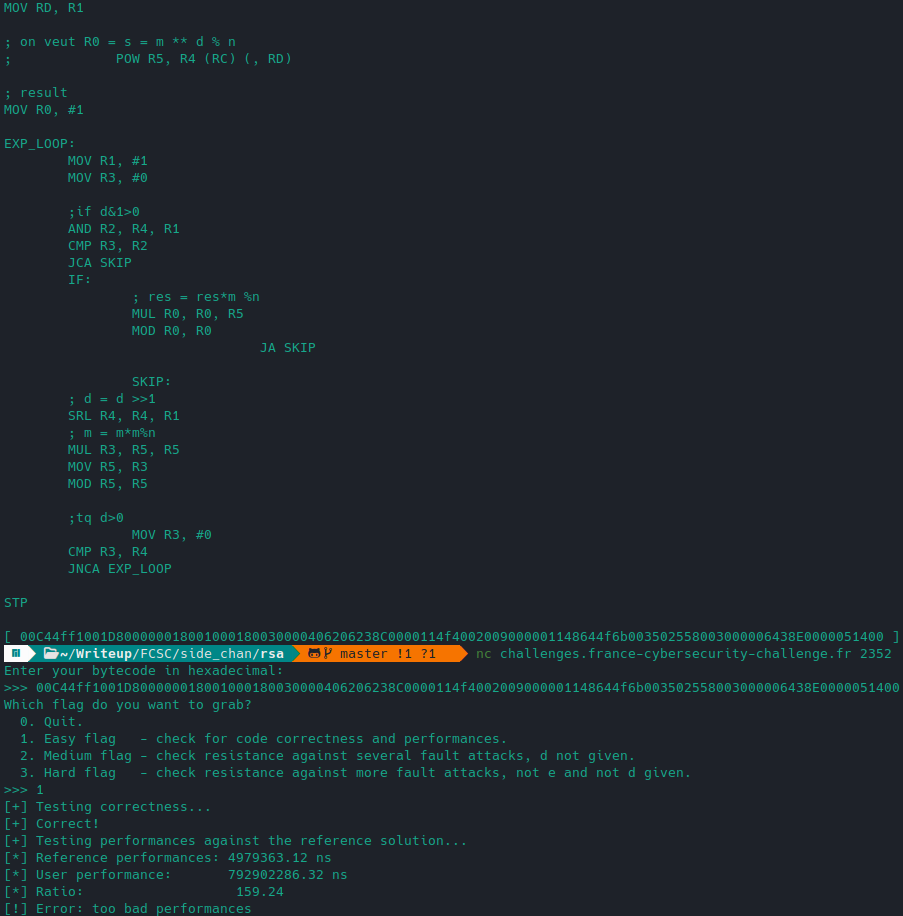
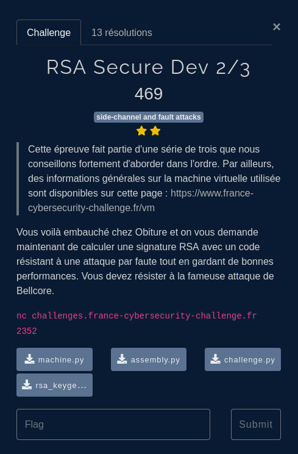
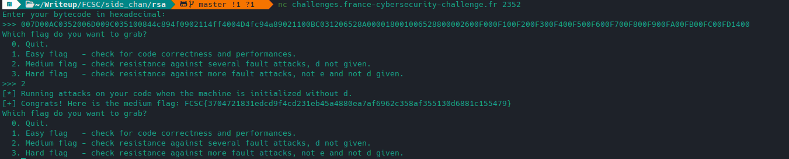
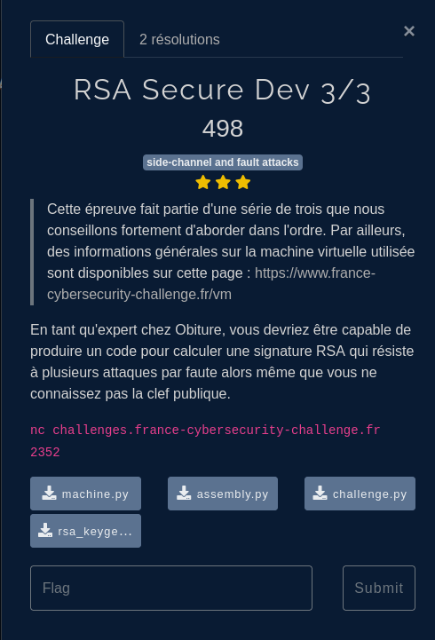

## Enonce

Poursuivons notre lancée sur RSA. Ici nous allons nous intéresser aux mécanismes permettant de calculer une signature avec de bonnes *performances* et avec un *code sûr*.

En effet comme mentionné dans le [**précédent post**](../smthg_wrong/) nous allons devoir non plus mettre en place mais résister à une attaque par fautes.


Cette **série de 3 challenges** avait pour particularité de faire partie des 5 challenges utilisant la **machine virtuelle** du FCSC.

- machine.py : le fichier Python évaluant les instructions de cette machine.
- assembly.py : un assembleur décrit plus bas.
- rsa_keygeneraton.py : un générateur de clés aléatoire
- challenge.py : le fichier du challenge 

Ce dernier contenait notamment une vérification de notre *bytecode*

```python
def easy(code):
    correctness(code)
    performances(code)
    flag_easy = open("flag_easy.txt").read().strip()
    print(f"[+] Congrats! Here is the easy flag: {flag_easy}")
```

Nous devions implémenter un **compilateur** pour traduire les problèmes avec le langage assembleur fourni (proche d'ARM) en bytecode:

```python
from assembly import assembly

source=""

def compile(code):
	global source
	source = code
	z = assembly(code.upper().split('\n'))
	print(code)
	print("[",z,"]")
	return z.encode()

def stub():
	code = f"""
; la machine est initialisée comme suit
; R5 = m 
; R6 = p
; R7 = q
; R8 = iq = q**(-1) % p
; R9 = dp = e**(-1) % p-1
; RA = dq = e**(-1) % q-1
; RB = e
; RC = d
; RD = n

//CODE
; R0 doit contenir le résultat

STP
	"""
	return compile(code)

stub()
```

## Méthode(s) naïve(s)

On peut penser à exploiter l'instruction `POW` déjà présente. Cependant la contrainte de performance n'est pas vérifiée:


Oubliez tout de suite l' `exponentiation rapide "maison"`, les performances sont désastreuses:



`POW` était donc bien nécessaire mais comment faire mieux?

## Optimisation avec iq

En faisant une recherche, curieux de disposer dans les registres de `iq, dp et dq` on tombe sur ceci: https://www.cosade.org/cosade19/cosade14/presentations/session2_b.pdf

On peut découper le travail en calculant l'exponentiation sur p et q de tailles bien plus petites.
Tout ceci tient au `théorème des restes chinois`:


Attention à certaines spécifités:

- `RD` doit contenir le modulo de l'opération (MOD ou POW) , `RC` : l'exposant (d, p ou q)
- `MUL` ne peut opérer que sur `R[0-7]`

```asm
; R5 = m
; R6 = p
; R7 = q
; R8 = iq = q**(-1) % p
; R9 = dp = e**(-1) % p-1
; RA = dq = e**(-1) % q-1
; RB = e
; RC = d
; RD = n

; dp en exp
; p en mod
MOV RC, R9
MOV RD, R6
POW R1, R5 ;s1 = m**dp %p

; dq en exp
; q en mod
MOV RC, RA
MOV RD, R7
POW R2, R5 ;s2 = m**dp %q

; p en mod
; s1-s2 dans R3
; iq*(s1-s2) dans R4 
; h = iq*(s1-s2) %p dans R0
MOV RD, R6
SUB R3, R1, R2
MOV R4, R8
MUL R3, R4, R3 ;ATTENTION : R[0-7] pour MUL
MOD R3, R3

; s2 + hq dans R0
MUL R1, R3, R7
ADD R0, R2, R1

STP
```


`Congrats! Here is the easy flag: FCSC{06de1084d295f2a016f79485f2a47744bfb9ed3e30e9312121665559df9447de}`

# RSA 2/3



Ainsi nous avons implémenté dans un premier temps **RSA - CRT**: https://www.di-mgt.com.au/crt_rsa.html . Toutefois notre implémentation sera vulnérable aux attaques comme vu dans le [**précédent post**](../smthg_wrong/).

Ceci ne marche donc pas pour le 2nd test.


## Résolution

On reprend cette doc : https://www.cosade.org/cosade19/cosade14/presentations/session2_b.pdf


L'idée est d'utiliser un facteur aléatoire dans la signature RSA. On teste en python voir si ça marche:

```python
r = 2371   #rand
q = 17
m = 3
p = 19
e = 65537
phi = (p-1)*(q-1)
d = pow(e,-1,phi)

n = p*q
dp = pow(e,-1,p-1)
dq = pow(e,-1,q-1)

#algo

q_prim = (q*r)%p
q1 = m*pow(q_prim,e-2,p)
q2 = q1*pow(q_prim,2,p)
s1_p = (q1*pow(q2,dp-1,p))%p

p_prim =  (p*r)%q
p1 = m*pow(p_prim,e-2,q)
p2 = p1*pow(p_prim,2,q)
s1_q = (p1*pow(p2,dq-1,q))%q

s = (p*s1_q + q*s1_p)%n

print(pow(r*s,e,n)%n)
print(m)

# On veut r*s%n
print("signature oberthur:", r*s%n)
print("signature classique:",pow(m,d,n))
```


Vient l'implémentation en asm ...:

```asm
; R5 = m
; R6 = p
; R7 = q
; R8 = iq = q**(-1) % p
; R9 = dp = e**(-1) % p-1
; RA = dq = e**(-1) % q-1
; RB = e
; RC = d = exp
; RD = n = module

MOV R1, #200 ;r

;partie 1: s1_p
;q_prim = (q*r)%p
MUL R2, R7, R1
MOV RD, R6
MOD R2, R2

;q1 = m*pow(q_prim,e-2,p)
MOV R0, RB
MOV R3, #2
SUB R0, R0, R3
MOV RC, R0
POW R3, R2
MUL R3, R3, R5

;q2 = q1*pow(q_prim,2,p)
MOV RC, #2
POW R4, R2
MUL R4, R4, R3

;s1_p = q1*pow(q2,dp-1,p)
MOV R0, #1
MOV R2, R9
SUB R0, R2, R0 ; R0 = dp -1
MOV RC, R0
POW R0, R4
MUL R0, R0, R3 ; R0 = s1_p !!!

;partie 2: s1_q
; NE PAS ECRASER: R0,R1,R5,R6,R7
;p_prim = (p*r)%q
MUL R2, R6, R1
MOV RD, R7
MOD R2, R2

;p1 = m*pow(p_prim,e-2,q)
MOV R4, RB
MOV R3, #2
SUB R3, R4, R3
MOV RC, R3
POW R3, R2
MUL R3, R3, R5

;p2 = p1*pow(p_prim,2,q)
MOV RC, #2
POW R4, R2
MUL R4, R4, R3

;s1_q = p1*pow(p2,dq-1,q)
MOV R5, #1
MOV R2, RA
SUB R5, R2, R5 ; R5 = dq -1
MOV RC, R5
POW R2, R4
MUL R2, R2, R3 ; R2 = s1_q !!!

;s = (p*s1_q + q*s1_p)%n
; NE PAS ECRASER: R0,R1,R2,R6;R7
MUL R3, R6, R2
MUL R4, R7, R0

ADD R3, R3, R4
MUL R0, R6, R7 ;n dans RD
MOV RD, R0
MOD R3, R3 ; s dans R3

;r*s%n

MUL R0, R1, R3
MOD R0,R0

STP
```


Ce code est correct, performant mais ne résiste pas à l'attaque.

## Principe du verrou

Il existe en effet de nombreuses façons d'injecter une telle faute: 

- corrompre en mémoire, 
- sauter une instruction dans l'exponentiation, 
- corrompre le résultat de l'exponentiation, 
- corrompre le message à signer

Comme vu précédemment, une **signature erronée + une signature valide** permettent de retrouver la clé **privée** ...

En notant `s` et `s'` respectivement la signature attendue et erronnée (à cause de l'attaque), nous devions vérifier que `s = pow(m,e,n)` (sans utiliser R0 jusque là) et écraser les registres sinon.


```bash
Inputs: res, s, s'
Output: res if s == s', erase everything otherwise

IF s != s' THEN ERASE
out = res
IF s != s' THEN ERASE
RETURN out
```

Ce qui peut s'implémentee comme ceci :

```asm
;RSA reencryption in R0
; RC = e
MOV RC, RB
POW R0, R1

; check against original message to avoid fault attacks
CMP R0, R5
JNZA ko
MOV R0, R1
STP

ko:
XOR R0, R0, R0
STP
```

Ce code permettait de résoudre le problème:

```asm
; R2 = Sq
MOV RD, R7 ; RD = q
MOV RC, RA ; RC = dq
POW R2, R5 ; m^dq % q

; R1 = Sp
MOV RD, R6 ; RD = p
MOV RC, R9 ; RC = dp
POW R1, R5 ; m^dp % p

; R1 = (Sp - Sq)Iq mod p
MOV R4, R8     ; R4 = Iq
SUB R1, R1, R2 ; Sp - Sq
MUL R1, R1, R4 ; * Iq
MOD R1, R1     ; % p

; R1 = R1*q + Sq mod N
MUL R4, R6, R7 ; R4 = N
MOV RD, R4     ; RD = N
MUL R1, R1, R7 ; * q
ADD R1, R1, R2 ; + Sq
MOD R1, R1     ; % N

; Check signature correctness
MOV RC, RB ; RC = e
POW R2, R1 ; R2 = s^e % N

; Lock principle
CMP R2, R5 ; R2 ? m
JNZA erase
MOV R0, R1 ; R0 = s
CMP R2, R5 ; R2 ? m
JZA end

erase:
MOV R0, RF
MOV R1, RF
MOV R2, RF
MOV R3, RF
MOV R4, RF
MOV R5, RF
MOV R6, RF
MOV R7, RF
MOV R8, RF
MOV R9, RF
MOV RA, RF
MOV RB, RF
MOV RC, RF
MOV RD, RF

end:
STP
```



`Congrats! Here is the medium flag: FCSC{3704721831edcd9f4cd231eb45a4880ea7af6962c358af355130d6881c155479}`

## RSA 3



Apparemment, il fallait éviter d'utiliser R0, une des fautes consistait à insérer un code STP après chaque instruction possible ... 

## Conclusion

Cette série était très intéressante et m'a permis de me familiariser à l'assembleur avec une petite nuit de débug, ainsi que de me sensibiliser aux attaques par fautes sur RSA - CRT, aussi bien du côté de l'attaquant que du défenseur sur cette partie.
